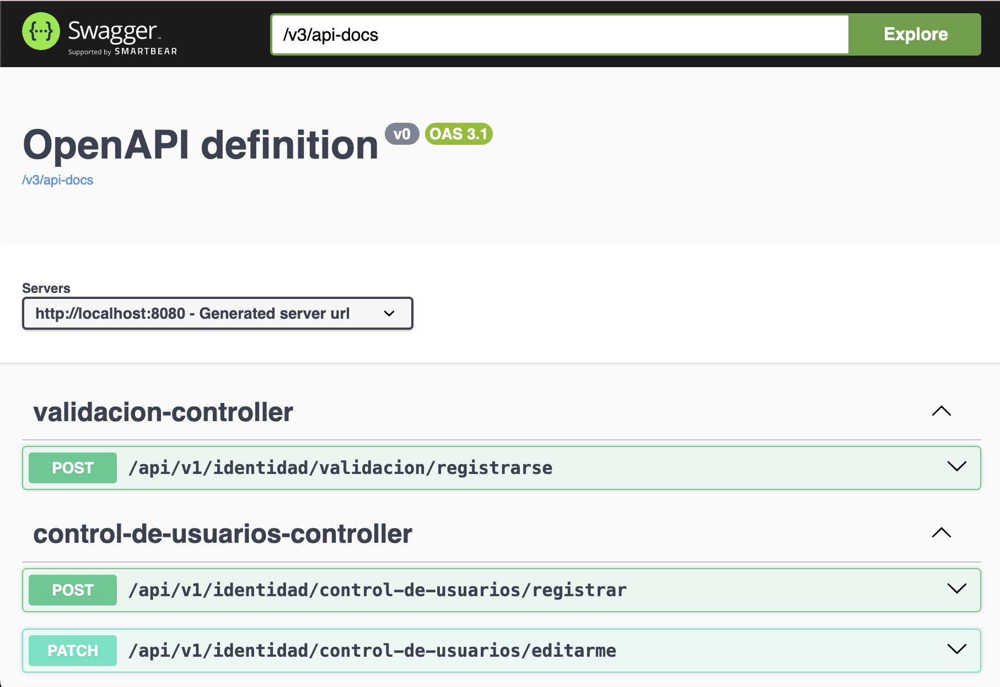

# CONGRESOS
Sistema de inscripciones y control de acceso para congresos y conferencias.

## Prerequisitos
Antes de correr esta aplicacion, asegurese de tener instaladas las siguiented aplicaciones en su sistema.

 - Docker
 - Docker Compose
 - Git
 - Java 24 (for local development without Docker)

## Inicio rapido con docker
La forma mas rapida de iniciar es con docker-compose.

### 1.- Clona el repositorio
Clonar.
```shell
git clone https://github.com/AlastorMordrek/congresos.git
```
Entrar a la carpeta.
```shell
cd congresos
```
### 2.- Ajusta variables de entorno
Edite el archivo .env con sus parametros preferidos.
Puede iniciar con copiar los parametros de muestra.
```shell
cp .env.example .env
```
### 3.- Ejecute el script de arranque
Asegurar permisos de ejecucion del script.
```shell
chmod +x setup.sh
```
Ejecutar el script.
```shell
./setup.sh
```
### 4.- Acceda a la aplicacion
El servidor estara escuchando peticiones http en el puerto especificado
en su archivo .env (default 8080) http://localhost:8080

#### Comprobacion visual.
Abra el siguiente link en su navegador y si ve la documentacion de las APIs
generada por Swagger, entonces la app inicio correctamente.
http://localhost:8080/swagger-ui.html

<div align="center">
  
</div>

## Inicio manual
Si prefiere correr la aplicacion sin docker.

### 1.- Asegurese que PostgreSQL esta corriendo
Cree la base de datos.
```shell
createdb congresos
```
### 2.- Configurar conexion de base de datos
Actualice el archivo de configuracion
`src/main/resources/application.properties`
con sus credenciales de base de datos.
Debe usar un usuario y clave de postgres.

### 3.- Compile y corra la aplicacion
Compilar.
```shell
./mvnw clean package
```
Correr.
```shell
java -jar target/*.jar
```

## Configuracion
La aplicacion provee y usa variables de configuracion para personalizar
el funcionamiento.

Variables clave incluyen:
 - DB_USR: Usuario de postgres (default: `admin`)
 - DB_PWD: Clave de acceso de postgres (default: `12345`)
 - DB_HOST: Host de postgres (default: `localhost`)
 - DB_PORT: Puerto de postgres (default: `5432`)
 - DB_NAME: Nombre de la base de datos (default: `congresos`)
 - WEB_SERVER_PORT: Puerto del servidor web (default: `8080`)

## Usuarios Pre-registrados
El sistema viene con usuarios pre-registrados para distintos roles:

 - Administrador: `congresos.administrador.1@tijuana.tecnm.mx`
 - Organizador: `congresos.organizador.1@tijuana.tecnm.mx`
 - Staff: `congresos.staff.1@tijuana.tecnm.mx` /
`congresos.staff.2@tijuana.tecnm.mx`
 - Alumnos: `congresos.alumno.1@tijuana.tecnm.mx` /
`congresos.alumno.2@tijuana.tecnm.mx`

#### Claves de acceso
La clave de acceso por defecto de todos los usuarios pre-regisrados es `12345`

## API Documentation
Cuando la aplicacion este corriendo, puede acceder a la documentacion
de APIs generada por swagger en:
http://localhost:8080/swagger-ui.html

Si desea la documentacion en formato JSON para usar en apps de pruebas como
POSTMAN, puede consultarla en:
http://localhost:8080/v3/api-docs

## Estructura del proyecto

```shell
congresos/
├── src/main/java/       # Codigo de la aplicacion de springboot
├── src/main/resources/  # Archivos de configuracion
├── docker-compose.yml   # Configuracion del contenedor de docker
├── Dockerfile           # Definicion del contenedor de aplicacion
├── setup.sh             # Script de configuracion automatica
├── .env.example         # Plantilla de variables de configuracion
└── README.md            # Este archivo
```

## Problemas tipicos
 - Conflicto de puertos: Si el puerto 8080 ya esta en uso, cambie la variable
WEB_SERVER_PORT en su archivo .env
 - Problemas de conexion de la base de datos: Asegurese que PostgreSQL esta
corriendo y accesible
 - Permisos de Docker: En Linux puede que deba correr comandos de Docker con
`sudo`
 - Variables de ambiente: Asegurese que todas las variables relevantes estan
ajustadas en su archivo .env

## Desarrollo con Docker

Esta guia te ayudara a configurar y utilizar el entorno de desarrollo Docker
para el proyecto.

### Configuracion Inicial

1.- Primera ejecucion:
```shell
./setup.sh --dev
```
Este comando:
 - Creara automaticamente un archivo `docker-compose.override.yml` desde la
plantilla
 - Construira las imagenes de Docker necesarias
 - Iniciara todos los contenedores (aplicacion y base de datos)

2.- Personalizacion del entorno:
 - Edita el archivo `docker-compose.override.yml` segun tus necesidades de
desarrollo
 - El archivo personalizado esta ignorado en git para evitar conflictos entre
desarrolladores

### Flujo de Trabajo Diario

### Control de la Aplicacion

Hemos creado un script de control para gestionar especificamente la aplicacion:

Detener solo la aplicacion (la base de datos permanece activa).
```shell
./app-control.sh stop
```
Reiniciar la aplicacion sin recompilar.
```shell
./app-control.sh restart
```
Recompilar y reiniciar la aplicacion (despues de cambios en el codigo).
```shell
./app-control.sh rebuild
```
Ver el estado de los contenedores.
```shell
./app-control.sh status
```

### Desarrollo con Recarga en Caliente

Cuando trabajes en el proyecto:

1.- Realiza tus cambios en el codigo fuente.

2.- Para aplicar cambios menores, usa:.
```shell
./app-control.sh restart
```
3.- Para cambios significativos que requieran recompilacion:
```shell
./app-control.sh rebuild
```
4.- Para depuracion, conecta tu IDE al puerto 5005 (configurado en el override).

### Finalizacion del Dia de Trabajo

Al terminar tu jornada:

Detener solo la aplicacion.
```shell
./app-control.sh stop
```
O detener todos los contenedores (incluyendo la base de datos).
```shell
docker-compose down
```

### Reanudacion del Trabajo

Para continuar trabajando despues de haber detenido los contenedores:

Si solo detuviste la aplicacion.
```shell
./app-control.sh restart
```
Si detuviste todos los contenedores.
```shell
docker-compose start
```
O si necesitas reiniciar todo el entorno.
```shell
./setup.sh --dev
```

### Problemas tipicos

Si encuentras problemas de dependencias:

Reconstruir completamente las dependencias
```shell
docker-compose down
docker volume rm nombre_proyecto_m2_cache
./setup.sh --dev
```

### Si la aplicacion no se inicia correctamente:

Ver los logs de la aplicacion.
```shell
docker-compose logs app
```
O ver los logs en tiempo real.
```shell
docker-compose logs -f app
```

### Personalizacion Avanzada

El archivo docker-compose.override.yml te permite:

 - Cambiar puertos de depuracion.
 - Modificar variables de entorno especificas para desarrollo.
 - Configurar montajes de volumenes adicionales.
 - Ajustar configuraciones de rendimiento.

Recuerda que este archivo no se versiona, por lo que cada desarrollador puede
tener su propia configuracion sin afectar a los demas.

### Notas Importantes

 - La base de datos utiliza un volumen persistente, por lo que tus datos se
conservaran entre reinicios.
 - Las dependencias de Maven se cachean en un volumen para acelerar
recompilaciones.
 - Los cambios en el codigo se reflejan inmediatamente gracias al montaje de
volumenes.

Este flujo de trabajo esta diseñado para maximizar la productividad en desarrollo mientras mantiene una configuracion consistente entre todos los entornos.

# Licencia
Este proyecto esta desarrollado para fines educativos y uso exclusivo
del TecNM - Instituto Tecnologico de Tijuana.
